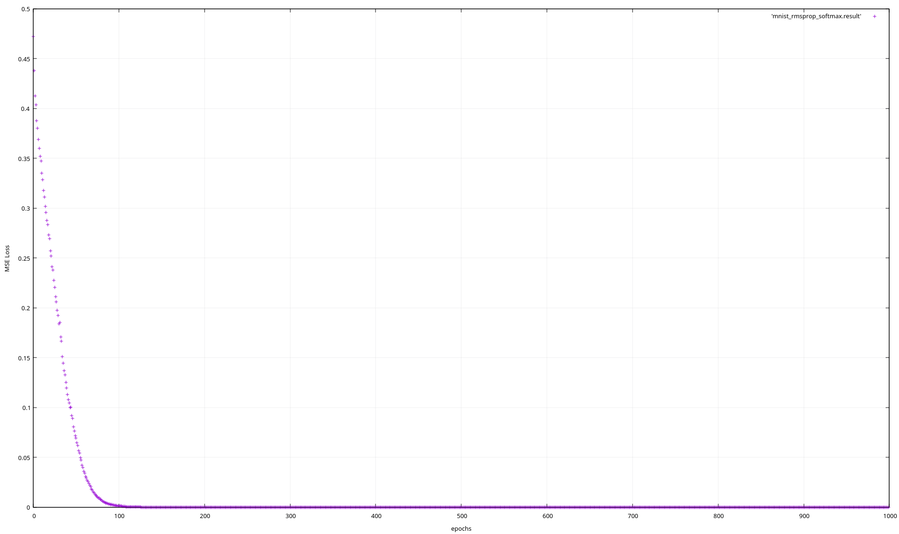

# Demo
## XOR
using the following simple architecture
- OPTIMIZER: none
- ACTIVATION LAYER 1: ReLU
- ACTIVATION LAYER 2: Linear
- LOSS: MSE( mean squared error )

We get the following loss vs epochs plot

## MNIST
using the following architecture
- INPUT LAYER: 784
- ACTIVATION LAYER 1: Sigmoid
- HIDDEN LAYER 1: 8
- ACTIVATION LAYER 2: ReLU
- HIDDEN LAYER 2: 8
- ACTIVATION LAYER 3: Softmax
- LOSS: Cross entropy
- OPTIMIZER: RMSProp

We get the following loss vs epochs plot

# Usage
some examples have been provided. Implementation of the network
to train on XOR, PIMA Indian diabetes dataset and MNIST has been provided in the following files:
- xor.cpp : training on xor
- diab.cpp : training on PIMA Indian dataset
- mnist.cpp : training on MNIST dataset
